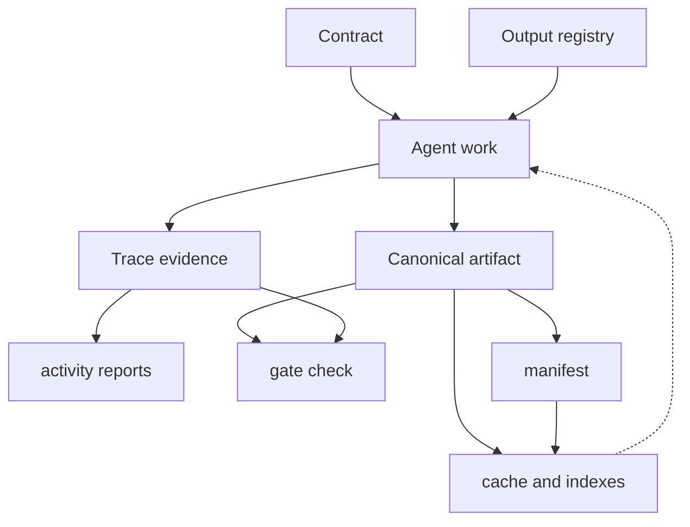

# TravelOps SDLC Knowledge Base

This directory is the shared source of truth for the project SDLC.

It is intentionally stored in the project repository so people and agents can collaborate through Git branches, pull requests, and code review.

## Operating Rules

- Keep durable knowledge in `.sdlc/`, not only in chat history.
- Work in story-scoped folders when possible.
- Append trace events instead of rewriting history.
- Record actor, run, thread, branch, and head SHA metadata on claims, traces, handoffs, approvals, locks, and sync events.
- For existing projects, create and review a baseline before treating inferred context as canonical.
- Do not treat permission to implement or push as formal artifact approval.
- Record formal approvals with `--approval-source explicit-user|ci|automation|bootstrap` plus summary or evidence.
- Use `--approval-source automation` only when a human/CI has explicitly delegated a matching approval level or autonomy scope; keep that scope in the summary/evidence.
- Use `requirement:v2` plus an approved requirement execution profile to record the maximum autonomy allowed for each requirement revision.
- Ask for an explicit `supervised`, `checkpointed`, or `bounded-autonomous` selection for every pull request and every local release; never reuse one delivery profile for another. One profile binds exactly one story and its one approved contract.
- For delivery work, reserve the planned profile ID in the requirement-bound story contract, approve that contract, then create the matching profile that binds its immutable hash. The ID is not a profile hash or approval; never introduce a circular back-reference.
- Compute effective autonomy from the most restrictive host, project, requirement, delivery, contract, capability, environment, and budget boundary.
- Treat `audit_only` as capped at `checkpointed`, including locally. Effective `bounded-autonomous` requires an external trusted host/CI Ed25519 receipt under `host_verified` policy; the CLI cannot self-issue trusted authority.
- Start a phase automatically only when it is present in the effective level's configured `automatic_phases`; `supervised` always confirms.
- Govern delivery actions as authorize → exact host/tool execution → complete with immutable evidence. A `host_verified` checkpoint requires an external Ed25519 receipt for the exact canonical action subject; `audit_only` records unverified explicit approval. Passing merge/local-release completion writes the success close receipt automatically.
- For local releases, record the target root, allowed canonical actions and writes, shell-free JSON-argv smoke tests, and rollback. Treat protected-branch merge and remote or production deployment as explicit exceptions.
- For reversible local data changes, require paired `data.migrate`/`data.rollback`, one exact file and scope set, immutable preview evidence outside mutable paths, an exact backup, and a verified rollback followed by the final passing migration. The CLI verifies hashes but never executes migration shell text.
- Before every new local release, require a passing `rollback.verify` receipt bound to the exact local root, write paths, rollback procedure, and immutable rehearsal evidence. The CLI verifies evidence and never executes a rollback command.
- Preserve durable host/CI/provider evidence for remote push and merge; live remote pre/post observations are hash-bound but are not provider-signed offline attestations.
- Run `agentic-sdlc orchestrate status` before starting work in another chat.
- Run `agentic-sdlc sync record --event push` after pushing a branch.
- Release story claims and phase locks when work is done or handed off.
- Link requirements, stories, decisions, tests, and release evidence.
- Keep epics, tasks, work breakdown agreements, and dependency graphs in `.sdlc/`.
- Keep reusable process definitions and overlays versioned under `.sdlc/workflows/`; pin every running instance to exact hashes and append events instead of rewriting its history.
- Approve work breakdown and dependency graph proposals before using them as delivery constraints.
- Record `dependency.revalidate` traces when downstream work is rechecked after upstream artifact changes.
- Resolve story outputs through `.sdlc/output-contracts/registry.json` before generating new durable artifacts.
- Reuse approved artifacts and create only deltas when related stories cover the same requirement.
- Ask for user approval before introducing a new output template or changing an approved output structure.
- Record completed phase lanes with `story complete-step` before handing off work.
- Use `story prepare-handoff --release-claim` to let another chat or machine continue from the KB.
- Use `report activity` for recent-history questions; reports must cite trace source files.
- Use `report query` for natural-language history filters after Codex normalizes them to canonical query JSON.
- Use `manifest rebuild`, `trace compact`, and plan-first `archive closed` as the KB grows.
- Run `agentic-sdlc gate check` before merging implementation work.
- Rebuild cache and indexes when retrieval speed matters; cache and indexes are derived artifacts, not sources of truth.

## Directory Map

```text
contracts/      Phase contracts and story-specific contracts
autonomy/       Requirement ceilings, per-delivery profiles, decisions, execution/action receipts
baseline/       Existing-project current-state baselines and approval records
workflows/      Versioned definitions, governed overlays, pinned instances, and append-only events
authorizations/ Explicit action-scoped grants for delegated automation approvals
output-contracts/ Approved output templates, artifact links, and structure decisions
requirements/   Product requirements and constraints
work-items/     Project-local epics and tasks
work-breakdown/ Approved decomposition decisions
dependencies/   Approved dependency graph and proposals
stories/        Story workspaces, claims, plans, and evidence
orchestration/  Parent-chat orchestration snapshots
locks/          Phase and shared-artifact locks
handoffs/       Story handoff records between agents and chats
decisions/      Architecture and product decision records
assumptions/    Explicit assumptions and their review status
risks/          Delivery, technical, product, and operational risks
tests/          Test plans, test evidence, and coverage notes
security/       Secret-scan records for the files a delivery changed
reviews/        Code-review records for pull-request deliveries
traces/         Append-only event logs
releases/       Release notes, rollout evidence, feedback loops
manifests/      Shared compact KB manifests
archive/        Archive plans and applied archive records
cache/          Local regenerable lookup cache
indexes/        Regenerable search indexes
reports/        Generated gate and audit reports
operations/     Incident and feedback records for a released change
```



## Human Governance

Agents may propose, generate, validate, and summarize. Humans keep responsibility for goals, architecture, trade-offs, approvals, and high-risk decisions.
